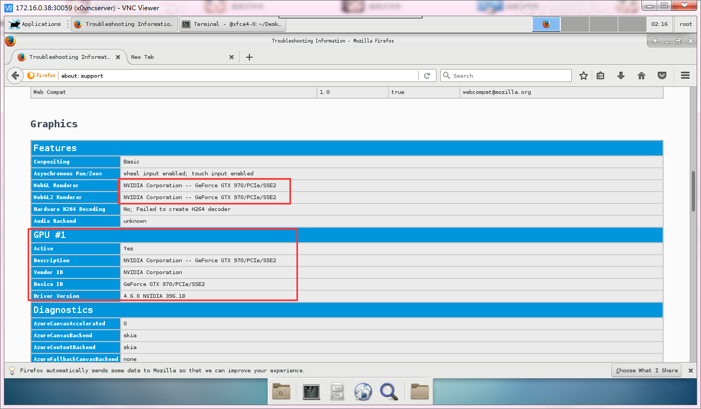

###share host tty device to containers , run X server inside docker ,  run startx and X11 3d application and desktop with nvidia-docker2

#screenshots

##firefox


this project is linkage with [centos7-xfce4](https://github.com/hakur/centos-xfce4)

## why i write this egg pain project
    * most article says run X server on host machine and mount X11 socket to container, but when you mount to many containers , host machine screen will becomes chaos
    * I don't want to run X server on host machine, I want to run X server inside docker to keep my screen clean
    * run 3d application (gaming , renderer )
    * try using matlab in desktop environment
    * my workmates think it's interesting
    * I can't find a way how to make Xvfb using nvidia-driver and /etc/X11/xorg.conf
    * I can't find a way to create a valid VT inside docker by using same command ( mknod -m 0620 /dev/tty99 c 4 0 )
    * X11 server need /dev/tty0 for I/O

##what this plugin will make changes to your host machine
    * it will automatically create a tty device on host machine, adrees is /dev/tty99


## required
    * centos 7 host machine
    * install X11 server on host, then install nvidia driver, (I guees must install x11 server before install nvidia driver,then nvidia will output /usr/lib64/xorg/modules/extensions) yum -y install xorg-x11-server-Xorg
    * nvidia-docker2 installed
    * privileged is required if run in container
    * kubernetes 1.9 (warning kubernetes 1.10 is deferent,api has changed,1.10 code has been written will push later)
    * an centos-xfce4 x11 desktop (will document this in later few days)
## Run in kubernetes
    ```
    kubectl apply -f https://raw.githubusercontent.com/hakur/k8s-tty-device/master/k8s-tty-device.yml
    ```
## Notice
    * master branch code version is kubernetes 1.9
    * xrog-glx is conflict with nvidia-glx (I hate this war)
    * if you want to install nvidia driver,  you must diable nouveau kernel module
    
            try search blacklist nouveau on google  or using very dangerious way (  modprobe -r nouveau )
    
    * nvidia driver seems no binary version, it's manual build with gcc and kmod (yum -y install gcc kmod pkgconfig),here is a simple command to build nvidia driver
    
            NVIDIA-Linux-x86_64-396.18.run -a -N --no-x-check --ui=none -s -q -no-nouveau-check --no-cc-version-check
    


